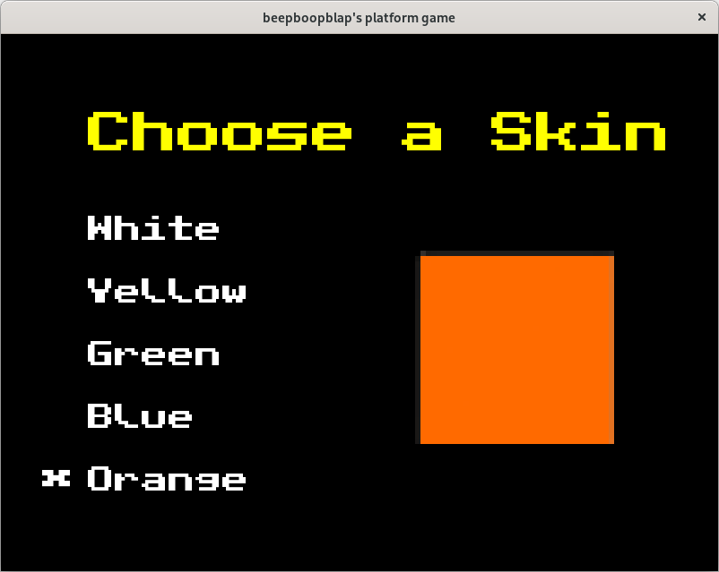
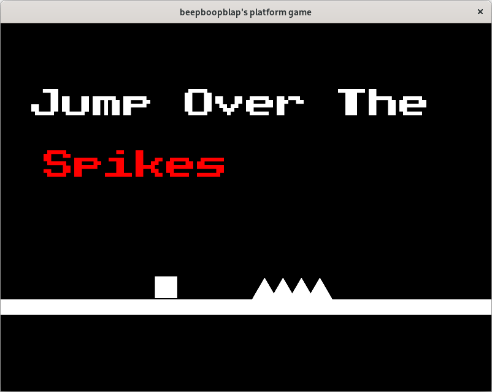
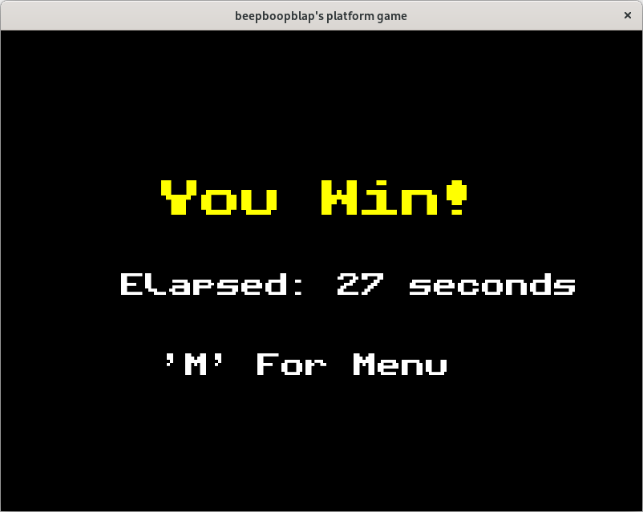

# Platform-Game-Pygame

*still a work in progress*

A Platform game made by beepboopblap

# Previews

# Contributions

Created with a little help of Mr Baumgarten's Youtube playlist on programming with pygame.

Playlist: https://youtube.com/playlist?list=PLM-syYolLbsz5paY9gafMzMpWgv-h4ac6

Channel: https://www.youtube.com/user/pbaumgarten

# Updates

March 14 11:09am (GMT + 8) - You may now choose a different color for your player sprite!

March 13 9:44am (GMT + 8) - Added a stopwatch, background music and a game over sound effect

March 12 5:38pm (GMT + 8) - Added a new level 

March 12 8:55am (GMT + 8) - Added colors 

March 12 8:31am (GMT + 8) - Made it so that players could diagonally jump (press two movement keys at the same time)

March 11 4:33pm (GMT + 8) - Added a retry option if you lose

March 11 3:54pm (GMT + 8) - Patched a bug from the third level

March 11 3:51pm (GMT + 8) - Added another level with and added a win screen

March 11 2:11pm (GMT + 8) - Uploaded to github with 2 easy levels
